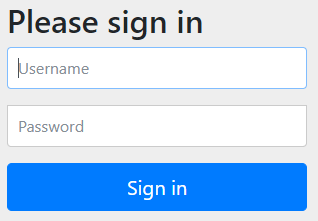
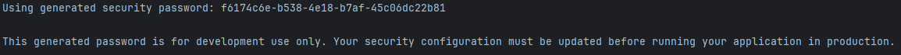
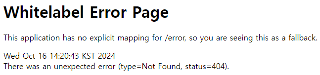

# Step 1: Basic Spring Security Configuration
## 1. build.gradle Dependency
```
dependencies {
    implementation 'org.springframework.boot:spring-boot-starter-security'
    implementation 'org.springframework.boot:spring-boot-starter-web'
}
```

## 2. Create a Welcome Page
프로젝트의 정적 경로에 웰컴페이지 생성하기`'src/main/resources/index.html'`

## 3. Check User Authentication process in Login Form
### 1) http://localhost:8080/ 페이지로 이동

> ### 스프링 시큐리티의 기본 구성<br> 
> 스프링 시큐리티는 기본적으로 아래와 같은 방식으로 사용자 인증을 처리한다. <br>
> 인증되지 않은 사용자는 기본 로그인 페이지로 리다이렉트 한다.<br>
> 기본 인증 방식: 폼 로그인<br>
> 기본 로그인 페이지 URL : [GET] http://localhost:8080/login<br>
> 로그인 폼 전송 URL : [POST] http://localhost:8080/login<br>
> * 스프링 시큐리티의 기본 로그인 페이지<br>


### 2) 스프링 시큐리티가 생성해준 계정 정보를 입력<br>
> ### 스프링 시큐리티의 임시 계정 발급<br>
> 별도의 구성이 없다면 스프링 시큐리티는 기본 계정과 난수 패스워드를 생성한다.<br>
>Username은 `user` Password는 런타임 중에 랜덤으로 생성해 준다.
>  * 아래와 같이 터미널에서 확인할 수 있음.<br>
>   

### 3) 웰컴 페이지가 정상적으로 출력 되었다면 인증 성공
  * index.html이 없는 경우<br>
  * index.html을 구성한 경우<br>